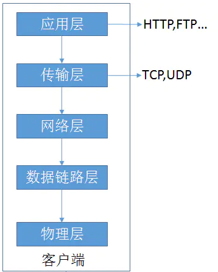
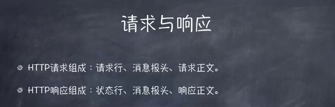
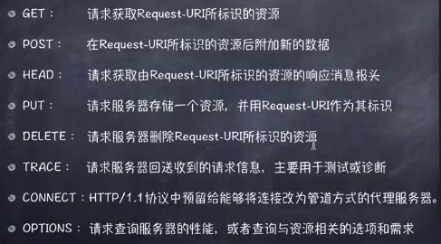
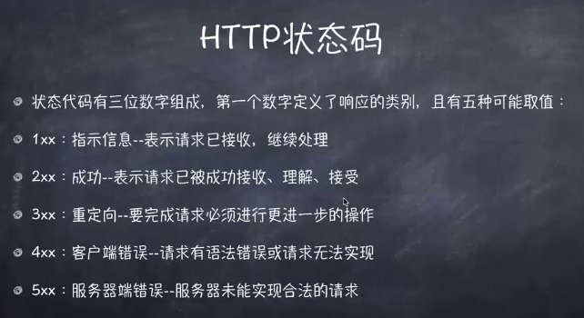
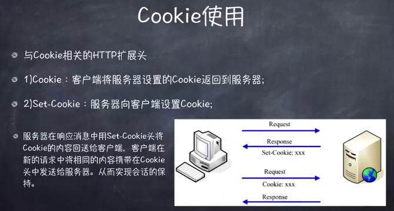
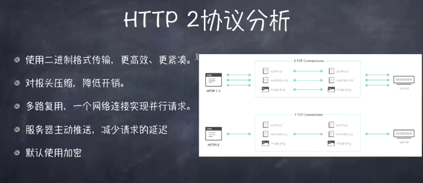
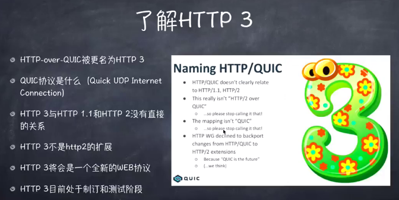

# HTTP

## 01. 经典五层模型



1. 应用层 
   - 为应用软件提供了很多服务，构建于协议之上。
2. 传输层
   - 数据的传输都是在这层定义的，数据过大分包，分片。
3. 网络层
   - 为数据在节点之间传输创建逻辑链路
4. 数据链路层
   - 通讯实体间建立数据链路连接
5. 物理层
   - 主要作用是定义物理设备如何传输数据（光缆，网线）

## 02. HTTP协议的发展历史

- http0.9 :

  - 只有一个命令GET，没有header等描述数据的信息，服务器发送完毕，就关闭tcp协议。

- http1.0:

  - 增加了请求命令（GET, POST 和 HEAD）
  - status code
  - header
  - 多字符集支持
  - 权限
  - 缓存
  - 内容编码
  - 多部分发送

  **缺点：**

  > HTTP/1.0 版的主要缺点是，每个TCP连接只能发送一个请求。发送数据完毕，连接就关闭，如果还要请求其他资源，就必须再新建一个连接。
  >
  > TCP连接的新建成本很高，因为需要客户端和服务器三次握手，并且开始时发送速率较慢。所以HTTP 1.0版本的性能比较差。随着网页加载的外部资源越来越多，这个问题就愈发突出了。
  >
  > 为了解决这个问题，有些浏览器在请求时，用了一个非标准的Connection字段。`Connection: keep-alive`
  >
  > 这个字段要求服务器不要关闭TCP连接，以便其他请求复用。服务器同样回应这个字段。
  >
  > 一个可以复用的TCP连接就建立了，直到客户端或服务器主动关闭连接。但是，这不是标准字段，不同实现的行为可能不一致，因此不是根本的解决办法。

- http1.1: 

  - 增加了请求命令（OPTIONS、PUT、PATCH、DELETE、TRACE 、CONNECT）
  - 持久连接
  - 增加host

  **缺点:**

  > 虽然1.1版允许复用TCP连接，但是同一个TCP连接里面，所有的数据通信是按次序进行的。服务器只有处理完一个回应，才会进行下一个回应。要是前面的回应特别慢，后面就会有许多请求排队等着。这称为**队头堵塞**
  >
  > 为了避免这个问题，只有两种方法：
  >
  > 1. 减少请求数
  > 2. 同时多开持久连接
  >
  > 这导致了很多的网页优化技巧，比如合并脚本和样式表、将图片嵌入CSS代码、域名分片（domain sharding）等等。如果HTTP协议设计得更好一些，这些额外的工作是可以避免的。

- spdy协议:  谷歌自行研发, 主要解决http1.1效率不高的问题,被当做http2的基础,主要特性都被http2继承

- http2:
  - 二进制传输
  - 信道复用
  - 分帧传输
  - server push

## 03. HTTP三次握手


  第一次握手: 发送*SYN*报文，传达信息：“你好，我想建立连接”

  第二次握手: 回传SYN+ACK报文，传达信息：“好的，可以建立链接”；

  第三次握手: 回传ACK报文，传到信息：“好的，我知道了，那我们连接”。然后就建立连接了

> TCP为什么要进行三次握手：
>
> 因为网络传输有延迟，客户端发送请求到服务器端要求建立连接，如果服务器端直接返回的话可能会产生丢包的情况导致客户端接收不到数据，客户端会因为超时就关闭了，可能就去发送新的请求了，然而服务端并不知道丢包导致客户端没有接收数据，服务端端口就一直开着，造成了额外的开销。所以需要三次握手确认这个过程。

## 04. HTTP四次挥手

第一次挥手: 客户端 和 服务器 打电话，通话即将结束后

第二次挥手: 客户端说“我没啥要说的了”，服务器回答“我知道了”，但是 服务器 可能还会有要说的话

第三次挥手: 客户端 不能要求 服务器 跟着自己的节奏结束通话，于是 服务器 可能又巴拉巴拉说了一通，最后 服务器 说“我说完了

第四次握手: 客户端 回答“知道了”，这样通话才算结束。

> TCP为什么要进行四次握手:
>
> 因为数据传送结束后发出连接释放的通知，待对方确认后进入半关闭状态。当另一方也没有数据再发送的时候，则发出连接释放通知，对方确认后就完全关闭了TCP连接。

## 05. HTTP报文

- 请求报文

- 响应报文



​			 

### HTTP请求方法



1. 用来定义对于资源的操作

2. 常用有GET、POST等

3. 从定义上讲有各自的语义


### HTTP状态码



1. 定义服务器对请求的处理结果
2. 各个区间的code有各自的语义
3. 好的http服务可以通过status code判断结果

**注意:**

​	301 永久跳转(走缓存)

​	302 临时跳转

## 06. 跨域(CORS)

1. 什么是跨域

   - 浏览器的**同源策略**限制了跨域请求资源

2. jsonp跨域

3. 跨域的限制(预请求)

   - 默认跨域允许的方法只有get、post、head，其它的方法不允许

     ```js
     'Access-Control-Allow-Methods': 'POST,PUT,DELETE', // 设置通过请求的方法
     ```

   - 默认允许Content-type以下3个，其它预请求验证，通过才能发送
     - text/plain
     - multipart/form-data
     - application/x-www-form-urlencoded

   - 请求头限制,自定义的请求头是不允许，预请求验证通过才能发送

     ```JS
     'Access-Control-Allow-Headers':'X-Test-Cors', // 设置通过自定义的请求头
     'Access-Control-Max-Age':'1000' // Methods和Headers的结果可以被缓存多久
     ```

## 07. Cache-Control

- 可缓存性 
  - public   任何都可以
  - private  只有它发起浏览器可以缓存
  - no-cache 去服务端验证才能使用
  - no-store  彻底不能
  - no-transform 代理服务器不能改动返回内容

- 到期时间(seconds)
  - max-age = < seconds >  最大时间
  - s-maxage = < seconds > 只有在代理服务器才会生效
  - max-stale = < seconds > 只能在发起端设置 就算max-age时间过期 max-stale时间没过期也会走缓存

- 重新验证(了解)

  - must-revalidate 
  - proxy-revalidate 

- 验证头     (不走本地缓存 发送请求带上验证头 验证决定走不走缓存 它基于no-cache的情况）
  - last-Modified

    - 配合If-Modified-Since或者If-Unmodified-Since使用
    - 对比上次修改时间以验证资源是否需要更新

  - Etag

    - 数据签名

    - 配合if-Match或者if-Non-Match使用

    - 对比资源的签名判断是否使用缓存


## 08.  Cookie

​		

### 用法：

- 通过Set-Cookie设置
- 下次请求会自动带上
- 键值对，可以设置多个

### 属性：

- max-age 和 expires设置过期时间
- Secure只在https的时候发送
- HttpOnly无法通过document.cookie访问

## 09. HTTP长连接

- TCP connection  
  - Connection: keep-alive/close(开启/关闭)
  - HTTP2只需要建立一个TCP长连接 (同域下)

## 10. 数据协商：

- 请求

  - Accept    什么类型

  - Accept-Encoding  压缩方式
  - Accept-Language  语言
  - user-Agent  浏览器信息

- 返回
  - Content-type 
  - Content-Encoding
  - Content-Language	

## 11. CSP(内容安全策略)

- 限制方式

  Content-Security-Policy ：'default-src'

- 资源类型

  ```js
  'Content-Security-Policy': 'script-src \'self\'; form-action \'self\'; report-uri /report'
  ```

## 12.  HTTPS

- http 是明文传输

- https 通过握手进行加密
  - 加密-公钥
  - 解密-私钥


1. 客户端请求服务器获取`证书公钥`
2. 客户端(SSL/TLS)解析证书（无效会弹出警告）
3. 生成随机值
4. 用`公钥加密`随机值生成**密钥**
5. 客户端将`秘钥`发送给服务器
6. 服务端用`私钥`解密`秘钥`得到随机值
7. `将信息和随机值混合在一起`进行对称加密
8. 将加密的内容发送给客户端
9. 客户端用`秘钥`解密信息

## 13. HTTP2



- 二进制协议

  - http1.1头信息必须是字符，数据体可以是文本,也可以是二进制
  - http2 全部都是二进制

- 头信息压缩

  - 头部信息一样的变相缓存

- 信道复用

  - 同一个连接里面发送多个请求不再需要按照顺序来

- 数据流

  - http1.1版取消数据流的唯一方法，就是关闭TCP连接。
  - http2 可以取消某一次请求，同时保证TCP连接还打开着，可以被其他请求使用。

- 服务器推送

  - Http2 服务端可以推送，主动向客户端发送请求

    > http1 解析html页面里面css、js文件, 需要解析到css和js文件发送请求等数据回来渲
    >
    > http2 解析html里面建立连接，如果有css、js文件，服务端会主动推送到客户端
    >
    > 不再发送请求获取css、js文件

  - 浏览器目前是必须开启https 才能使用http2

HTTP 和 HTTP2 对比演示的demohttps://http2.akamai.com/demo

## 14. HTTP3（了解）



## 15. Nginx 配置

1. 配置nginx
2. 配置代理缓存

3. 配置https

   ```JS
   openssl req -x509 -newkey rsa:2048 -nodes -sha256 -keyout localhost-privkey.pem -out localhost-cert.pem
   ```

4. 配置http2

## 16. 面试题

1. 为什么传统上利用多个域名来提供网站资源会更有效
2. Long-Polling、Websockets、Server-Sent Event(SSE)、WebRTC
3. 常见的请求头和响应头
4. 和缓存有关的`HTTP`首部字段(非常重要)
5. HTTP method
6. HTTP 状态码
7. HTTPS 加密过程
8. HTTP2新特性（重要）

9. 三次握手四次挥手(重要)


证书秘钥

```js
openssl req -x509 -newkey rsa:2048 -nodes -sha256 -keyout localhost-privkey.pem -out localhost-cert.pem
```

